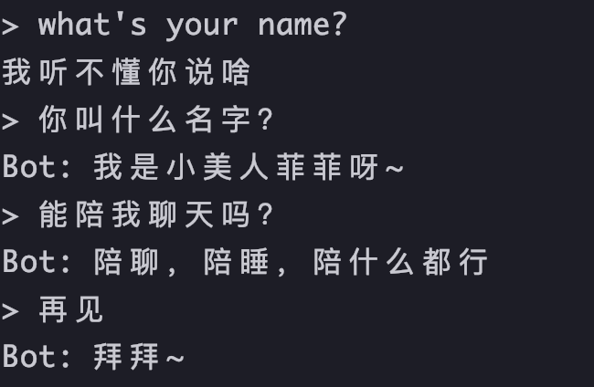

# 对话机器人训练实验 - 基于seq2seq及attention机制
   项目是基于官方的[对话机器人教程](https://pytorch.org/tutorials/beginner/chatbot_tutorial.html)进行编写的。可以实现基于原始的对话语料（一问一答形式）训练深度学习对话机器人。
具体可实现效果如下：
   

## 项目构成
```
├── corpus    存放语料及语料预处理代码
├── data.py   数据预处理
├── data_transform.py  将数据转化成模型能够接收的格式
├── evaluate.py  测试模型
├── main.py  训练主程序
├── model.py  编码器-解码器模型
├── models   存储模型
├── settings.py  项目参数
├── train.py   训练相关代码
├── utilis.py  工具函数
└── vocabulary.py  将文本字符转化为字典
```
 
## 如何训练模型？
修改setting文件的若干参数， 其他参数都可以不用管， 必须要修改的是以下参数：  
- corpus_name语（料名称）， 最后模型的命名会根据这个来；
- data_file（数据所在位置），可选： corpus/qingyun_seg或corpus/xhj_seg, 
以青云语料数据为例， 数据形式如下（都要分词过）:
```
南京 在 哪里 | 在 这里 了
咋死 ??? 红烧 还是 爆炒 | 哦 了 哦 了 哦 了 , 咱 聊 点 别的 吧
你 个 小 骚货 ， 哥哥 的 巴操 你 爽 不 爽 ？ | 不要 这样 说 嘛 ！ 很 不 文明 哦
额 麻麻 怎么 会 有 那 玩意儿 | 无法 理解 您 的话 ， 获取 帮助 请 发送 help
孩纸 , 新年 快乐 | {r + }同 乐同乐 ， 大家 一起 乐 ~
拿 尿 冲 一 冲 | 今天 这 天气 很 适合 聊天 的 说
```
- 语料的处理的方法名称：read_voc_method， 可选：qingyun或xhj， 两者分别对青语云和小黄鸡语料

在配置完其他训练相关参数以后， 可以运行以下代码来训练模型
```
 python main.py
```
这样就会在models下面出现相应的模型， 然后我们可以通过运行以下代码来测试模型的效果
```
python evaluate.py
```


   
  
 